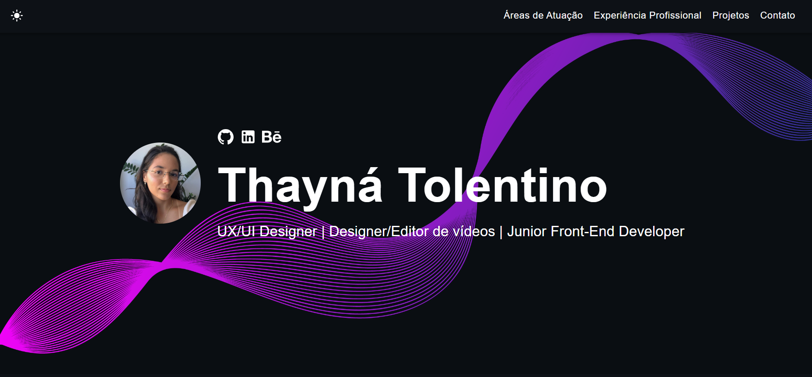

# Portfólio de Design & Vídeo | Thayná 🚀

    

## Sobre o Projeto

Este é o meu portfólio pessoal, um espaço criado para apresentar meus projetos de design, edições de vídeo e outras habilidades criativas.

Veja a **[versão ao vivo aqui](https://thaynarlt.github.io/portfolio-react/)**.

Este site foi construído a partir de um template de código aberto. Sinta-se à vontade para explorar o código.



## Funcionalidades do Template

✅ Código aberto e de uso livre.
✅ Design responsivo e amigável para dispositivos móveis.
✅ Suporte para temas claro (light mode) e escuro (dark mode).
✅ Layout personalizável baseado em componentes.
✅ Construído com tecnologias modernas (React, TypeScript, JavaScript e SCSS).

## Configuração Rápida (Para Desenvolvedores)

1.  Garanta que você tenha o [Node.js](https://nodejs.org/) instalado. Verifique sua versão com:
    ```bash
    node -v
    ```

2.  No diretório do projeto, instale as dependências:
    ```bash
    npm install
    ```

3.  Inicie o servidor de desenvolvimento:
    ```bash
    npm start
    ```

4.  Abra [http://localhost:3000](http://localhost:3000) para visualizar o app no navegador.

5.  Personalize o template navegando até a pasta `/src/components`. Modifique textos, imagens e outras informações conforme necessário.

## Publicação (Deploy)

Você pode hospedar seu site no serviço de sua preferência (Netlify, Vercel, etc.). Uma das formas mais fáceis é usando o GitHub Pages. Siga as instruções abaixo:

1.  **Configure o `package.json`**

    Edite as seguintes propriedades no seu arquivo `package.json`:

    ```json
    {
        "homepage": "[https://thaynarlt.github.io/portfolio-design-videos/](https://thaynarlt.github.io/portfolio-design-videos/)",
        "scripts": {
            "predeploy": "npm run build",
            "deploy": "gh-pages -d build",
        }
    }
    ```

2.  **Faça o Deploy para o GitHub Pages**

    Execute o seguinte comando para publicar seu site:
    ```bash
    npm run deploy
    ```

3.  **Acesse seu Site**

    Após a publicação, seu site estará disponível em `https://thaynarlt.github.io/portfolio-react/`.

---
*Créditos do template original para [Yuji Sato](https://github.com/yujisatojr/react-portfolio-template).*.